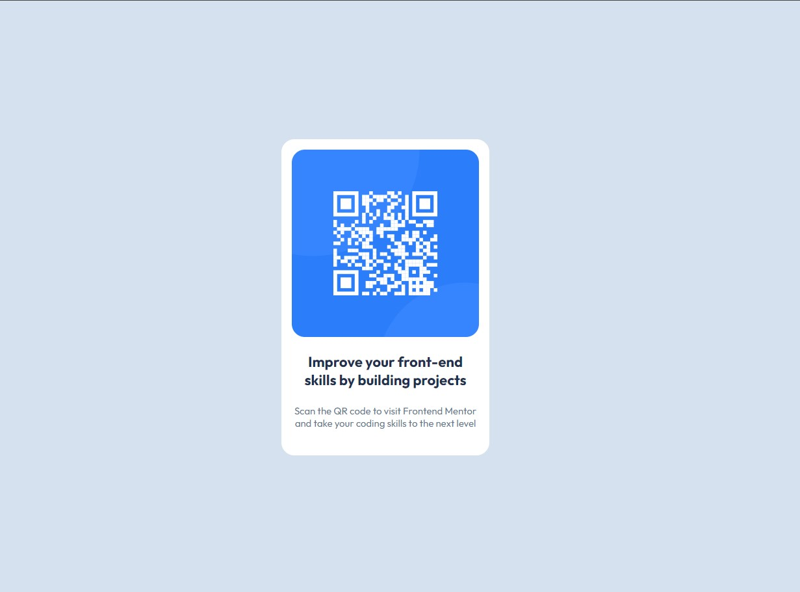
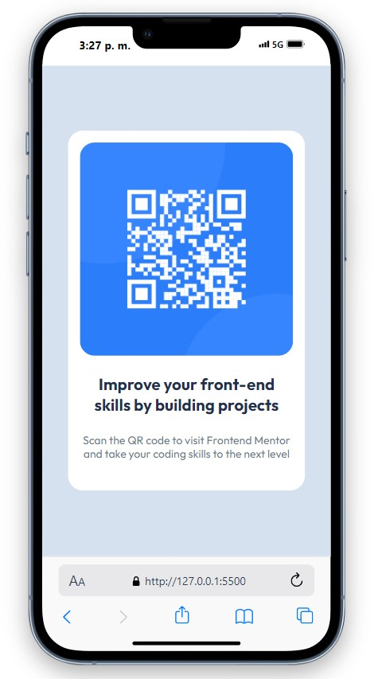

# Frontend Mentor - QR code component solution

This is a solution to the [QR code component challenge on Frontend Mentor](https://www.frontendmentor.io/challenges/qr-code-component-iux_sIO_H). Frontend Mentor challenges help me improve my coding skills by building realistic projects. 

## Table of contents

- [Overview](#overview)
  - [Screenshot](#screenshot)
  - [Links](#links)
- [My process](#my-process)
  - [Built with](#built-with)
  - [What I learned](#what-i-learned)
  - [Continued development](#continued-development)
- [Author](#author)

## Overview

### Screenshot

These are the screenshots of my solution on both views, in desktop and in mobile.

### Links

- Solution URL: [GitHub repo](https://github.com/LuisaRami2018/QRcode-FrontEndMentor)
- Live Site URL: [GitHub Pages](https://luisarami2018.github.io/QRcode-FrontEndMentor/)

## My process

### Built with

- Semantic HTML5 markup
- CSS custom properties
- Flexbox
- Mobile-first workflow

### What I learned

One of the key takeaways from this project was learning how to use Figma and apply the specified colors, fonts, and spacing from the design file. I used my understanding of HTML and CSS, particularly Flexbox, to successfully complete the project.

### Continued development

My goal is to learn the concepts required to develop a FrontEnd project and implement it using a framework such as Angular or React.

## Author

- Frontend Mentor - [@LuisaRami2018](https://www.frontendmentor.io/profile/LuisaRami2018)
