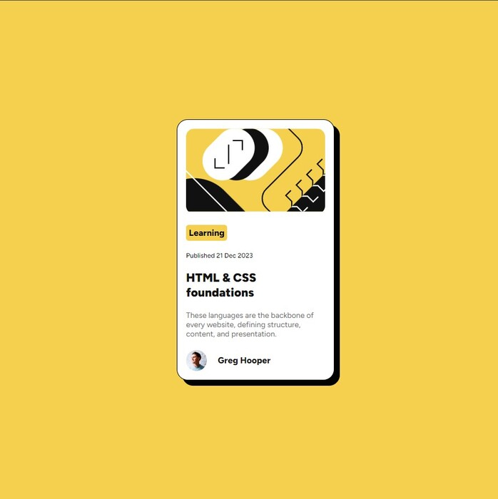
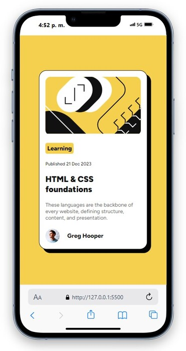

# Frontend Mentor - Blog preview card solution

This is a solution to the [Blog preview card challenge on Frontend Mentor](https://www.frontendmentor.io/challenges/blog-preview-card-ckPaj01IcS). Frontend Mentor challenges help me improve my coding skills by building realistic projects. 

## Table of contents

- [Overview](#overview)
  - [The challenge](#the-challenge)
  - [Screenshot](#screenshot)
  - [Links](#links)
- [My process](#my-process)
  - [Built with](#built-with)
  - [What I learned](#what-i-learned)
  - [Continued development](#continued-development)
- [Author](#author)


## Overview

### The challenge

Replicate the given design for both desktop and mobile views.

### Screenshot

Desktop view  


Mobile view  


### Links

- Solution URL: [GitHub Repo](https://github.com/LuisaRami2018/BlogCard-FrontEndMentor)
- Live Site URL: [GitHub Pages](https://luisarami2018.github.io/BlogCard-FrontEndMentor/)

## My process

### Built with

- Semantic HTML5 markup
- CSS custom properties
- Flexbox
- Mobile-first workflow

### What I learned

I discovered a property that I didn't know about to control the size of elements, such as text, and by using padding, I can make them look like buttons.
See the code snippet below:

```html
<p class="blog-button">Learning</p>
```
```css
.blog-button {
  width: max-content;
}
```

### Continued development

I would like to enhance my skills in Grid CSS and learn the React library.

## Author

- Frontend Mentor - [@LuisaRami2018](https://www.frontendmentor.io/profile/LuisaRami2018)


