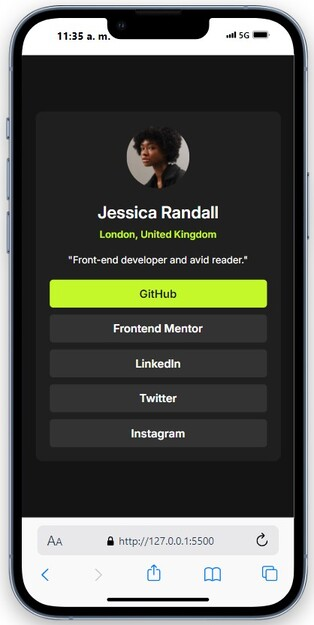
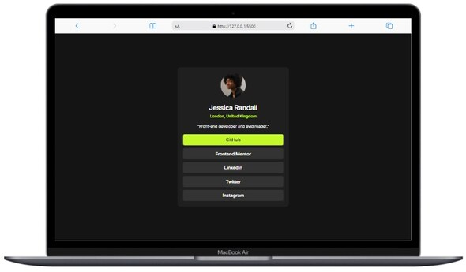

# Frontend Mentor - Social links profile solution

This is a solution to the [Social links profile challenge on Frontend Mentor](https://www.frontendmentor.io/challenges/social-links-profile-UG32l9m6dQ). Frontend Mentor challenges help me improve my coding skills by building realistic projects. 

## Table of contents

- [Overview](#overview)
  - [The challenge](#the-challenge)
  - [Screenshot](#screenshot)
  - [Links](#links)
- [My process](#my-process)
  - [Built with](#built-with)
  - [What I learned](#what-i-learned)
  - [Continued development](#continued-development)
- [Author](#author)

## Overview

### The challenge

Users should be able to:

- See hover and focus states for all interactive elements on the page

### Screenshot

Mobile view   

Desktop view  

### Links

- Solution URL: [GitHub Repository](https://github.com/LuisaRami2018/projects-FrontEndMentor/tree/master/03-social-links-profile)
- Live Site URL: [GitHub Pages (all projects)](https://luisarami2018.github.io/FrontEndMentor-projects/)
- Live Site URL: [GitHub Page social link profile Project)](https://luisarami2018.github.io/FrontEndMentor-projects/03-social-links-profile/index.html)

## My process

### Built with

- Semantic HTML5 markup
- CSS custom properties
- Flexbox
- Mobile-first workflow

### What I learned

I used the FlexBox property and adjust the text and image size as close as the design image

### Continued development

I would like to enhance my FrontEnd skills

## Author

- Frontend Mentor - [@LuisaRami2018](https://www.frontendmentor.io/profile/LuisaRami2018)

