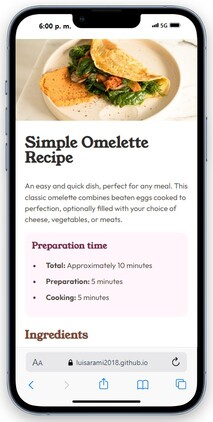
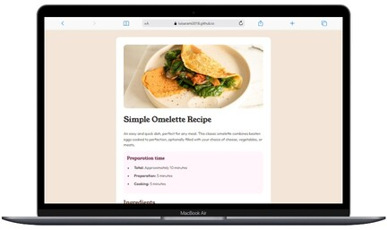

# Frontend Mentor - Recipe page solution

This is a solution to the [Recipe page challenge on Frontend Mentor](https://www.frontendmentor.io/challenges/recipe-page-KiTsR8QQKm). Frontend Mentor challenges help me improve my coding skills by building realistic projects. 

## Table of contents

- [Overview](#overview)
  - [Screenshot](#screenshot)
  - [Links](#links)
- [My process](#my-process)
  - [Built with](#built-with)
  - [What I learned](#what-i-learned)
  - [Useful resources](#useful-resources)
- [Author](#author)

## Overview

### Screenshot

Mobile view   
   

Laptop view   

### Links

- Solution URL: [GitHub repo](https://github.com/LuisaRami2018/FrontEndMentor-projects/tree/master/04-recipe-page)
- Live Site URL: [Main page](https://luisarami2018.github.io/FrontEndMentor-projects/)
- Live Site URL: [Challenge page](https://luisarami2018.github.io/FrontEndMentor-projects/04-recipe-page/index.html)

## My process

### Built with

- Semantic HTML5 markup
- CSS custom properties
- Flexbox
- Mobile-first workflow

### What I learned

In this challenge, I encountered some complexity as I was unsure how to change the color of the bullet/numeral to make it different from the text. However, I discovered how to use the pseudo-element ::marker to achieve this. Additionally, I also familiarized myself with the 
 tag, which proved to be quite useful during the challenge. The most challenging part was adjusting the image so that it had a margin in the laptop view, while occupying all the space of the container in the mobile view.

### Useful resources

::marker
https://developer.mozilla.org/es/docs/Web/CSS/::marker
- [
 documentation](https://www.freecodecamp.org/news/html-horizontal-line-hr-tag-example/) - This helped me to learn how to apply the 
 label 
- [::marker documentation](https://developer.mozilla.org/es/docs/Web/CSS/::marker) - This helped me to learn how to apply the pseudo-element ::marker. I'd recommend it to anyone still learning this concept.

## Author

- Frontend Mentor - [@LuisaRami2018](https://www.frontendmentor.io/profile/LuisaRami2018)